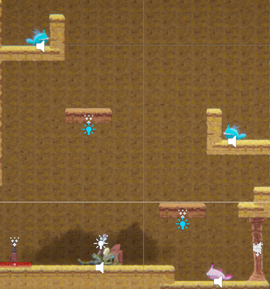
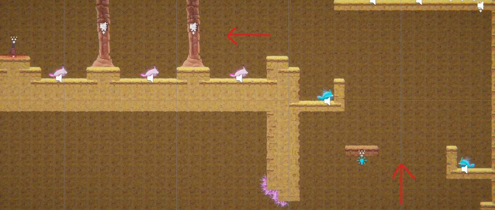
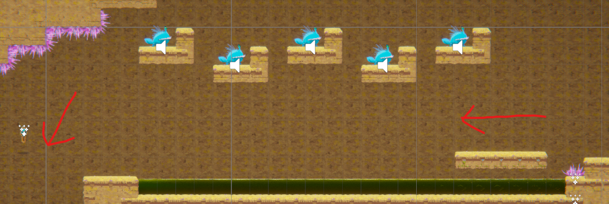
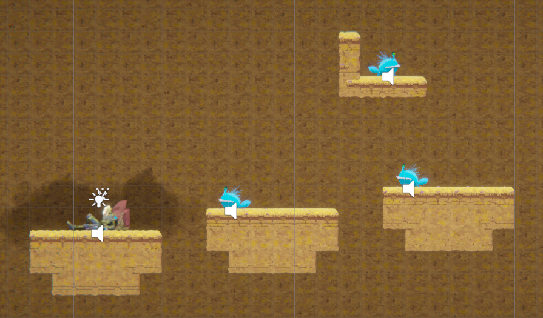
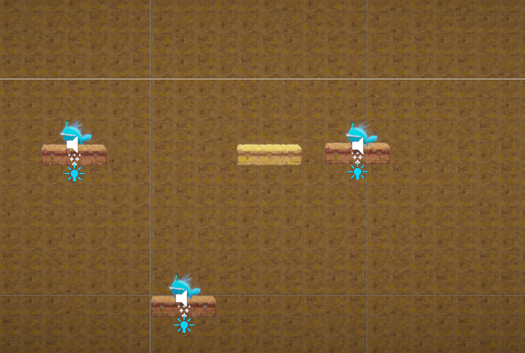
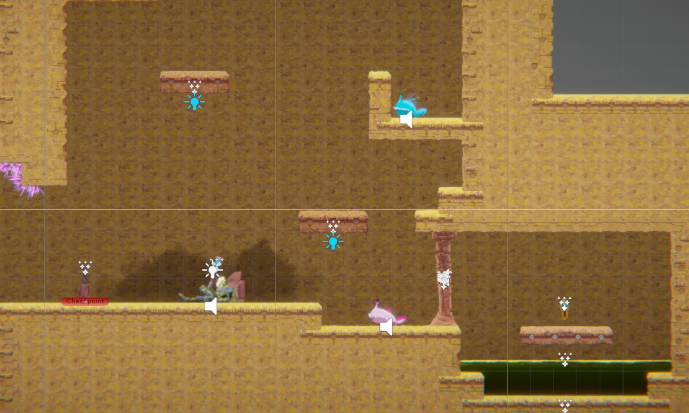
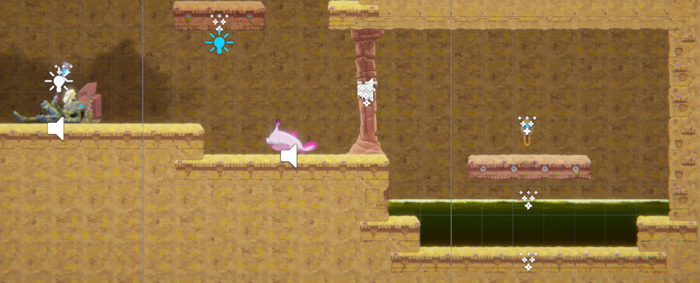
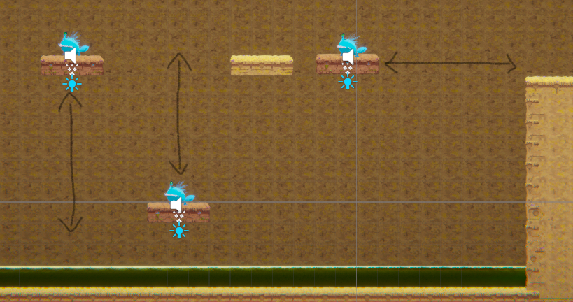

# COMP2150 - Level Design Document
### Name: Jai Bamforth
### Student number: 46981551

## 1. Player Experience

### 1.1. Discovery
What does the player learn? How does your encounter and broader level design facilitate learning in a way that follows good design practice?

The player learns how to navigate and explore a 2D space and discover objectives that allow them to complete the goal of the level. The core mechanics are communicated at the start of the game, allowing the player to discover how to move around the level and avoid obstacles. Players discover interesting combinations of various core mechanics as they progess, as they must learn how to use their basic core skills in tandem to complete and encounter.

The above section requires multiple of the player's discovered skills to progress through, including attacking with the staff, utilising moving platforms and avoiding enemies. The player discovers these patterns of play in prior encounters and is able to use them here to make it through the encounter.

### 1.2. Drama

The level begins very simple, as core mechanics need to communicated to the player before any moments of high tension are introduced. The player should feel a sense of calm as they learn these core mechanics. The player will then feel increased tension as more obstacles appear, while also experiencing relief after completing a hard section and being rewarded with an objective or checkpoint.

The two examples above showcase difficult portions of the level with high tension that are followed by relief as the player encounters a checkpoint or objective afterwards. This keeps a consistent intensity curve that allows the player to take a breath after a high intensity moment to prepare themselves for the next encounter.

### 1.3. Challenge

The main challenges of this level are avoiding obstacles and defeating enemies while achieving objectives. The level starts at a very low difficulty, so the player can learn core mechanics, before becoming more difficult as simple mechanics and obstacles are combined to create difficult encounters. This creates a slowly rising difficulty curve that peaks at the end of the level, as the player reaches the final objective. This is intended to keep a continuous flow across the level that stops players from feeling disjointed or that the level is too hard or too easy.

These two spitter encounters follow each other and have different levels of diffculty. This first encounter teaches the player how to use the gun pickup and provides static enemies for the player to shoot at. The second encounter raises the difficulty by having moving enemies for the player to shoot, requiring more skill with timing to shoot the enemies. There is a brief respite in between the sections, to give the player a connective space to prepare for the second encounter. There is also a checkpoint afterwards, so the player does not have to redo the section once they've mastered the challenge.

### 1.4. Exploration

The design of the level invites the player to explore the "alien temple" further by only providing one of three keys where the door is located. This means the player must explore the level of their own free will to locate the remaining two keys. The large, open spaces filled with a dangerous acid below create a distinct feel for the player, as they navigate around obstacles.

The player has the opportunity to miss objectives if they don't explore and just continue on with the level. This key is hidden behind a column and it's possible that the player may not see it. This invites the player to explore further, so they can complete level objectives.

## 2. Core Gameplay

### 2.1. Acid

Acid is a common obstacle across the whole level, so I wanted to introduce it very quickly to the player. It also introduces other main mechanics, including jumping, both long and short, as well as the health/damage system. The player should have a clear idea of these core mechanics before approaching the remainder of the level, so I found it imperative to introduce them immediately.

### 2.2. Spikes

The spikes are another source of damage for the player and appear as another frequent obstacle in the level. The player must be sure to weight their jump to make it through the gap without taking damage. It also introduces to the player that not all damage sources reset the player to the beginning of the level.

### 2.3. Moving Platforms and Health Pickup

This section introduces two more important mechanics to the player. Moving platforms are another common obstacle in the level, introducing a degree of challenge to the player, who must learn how to time jumps to avoid falling into acid. I found it important to introduce the player to this before they face other challenges that appear on moving platforms. The health pickup after this is to introduce to the player that they are able to recover health at certain points, and don't have 5 hitpoints for the whole level. It's also meant as a reward after potentially making mistakes in this first section.

### 2.4. Checkpoints, Keys and Key Door

The first checkpoint presents itself to the player after they have been introduced to the majority of the core mechanics. It may be unclear what this means to the player immediately, but if they are somewhat familiar with platformers then they may understand. This portion of the level also allows the player to pick up the first of three keys, introducing them to the main goal of the level. The player should notice that the door near them lights up, indicating that they must return to this point with two more keys. I found it important that the player - after learning core mechanics - understands the purpose of the level.

### 2.5. Gun Pickup and Spitters

The gun pickup is an important tool that now becomes available for the player to utilise. I thought it was important to introduce to the player that they have access to damage-dealing tools, as enemies also appear in this section. I placed the spitters at player shooting height so that they weren't too difficult for the player to defeat. More enemies and harder angles of fire appear from here on, so I wanted to communicate to the player that they are able to defeat enemies with the gun pickup.

### 2.6. Passthrough Platforms

This section is intended to introduce to the player that certain platforms have a pass-through capability that allows them to reach certain areas. The health pickup was placed there to give players an incentive to discover this gameplay feature, as they can't reach the health without utilising it. 

### 2.7. Staff Pickup and Chompers

This next sections introduces a new weapon type and new enemy type. I thought it was important to introduce to the player that they could utlise a second weapon type to deal with enemies that may be unreachable by the gun. I placed a chomper here to both introduce the new enemy to the player, but also have an enemy that they could test the staff on. They player then faces two spitters that they can attack with the staff (as the hitbox goes through walls), but not the gun.

## 3. Spatiotemporal Design

### 3.1. Molecule Diagram

### 3.2. Level Map – Section 1

### 3.3. Level Map – Section 2

### 3.4. Level Map – Section 3

## 4. Iterative Design

One extra section of the level I added through iterative design was destructible columns after the staff pickup is introduced. This gives the player a reason to use the staff immediately, as one of the three keys is hidden behind it. I also thought it was better to do this than just having the key sitting on the ground with zero challenge for the player.

I added various other small things into the level that helped to refine certain encounters that were initially too challenging, or not challenging enough. This included tweaking enemy numbers, checkpoint placement and adding or changing platform placement to better suit the level.

These moving platforms specifically were changed, going from 4 up-and-down platforms to 2, with a break in between before the final platform. The timing of the platforms didn't work the way I had intended to, so I had to change the layout or the encounter didn't flow well.

This above section featuring the final encounter of the level could have been improved more with some iterative design. The intent here was to create a somewhat "bullet hell" for the player to navigate through on the small platform. However, due to spitters being quite slow to shoot, the player doesn't experience much danger and can actually stand still through the encounter. I tried adding extra spitters (3 -> 5) to increase the difficulty, but it didn't do much to help. Iterative design would certainly help with tweaking this encounter to reach the intended challenge.

Overall, iterative design certainly helped me develop the level in a way that ensured it achieved flow in line with how I had intended it to. Without iterative design, some of the storyboards and level maps I had drawn would not have worked, leaving the level feeling clunky for the player.

